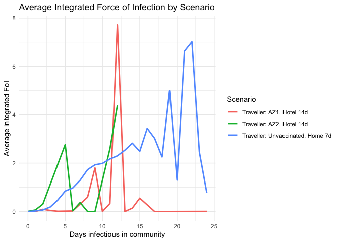

<!-- README.md is generated from README.Rmd. Please edit that file -->

# quarrisk

<!-- badges: start -->
<!-- badges: end -->

`quarrisk` is an R package that helps you understand and visualise the
risk of quarantine breaches under different COVID-19 quarantine and
vaccination scenarios. It turns simulation outputs into clear summaries
and includes a simple interactive Shiny dashboard.

## What this package does

- Provides a built-in dataset (breach_data) that summarises simulated
  infection outcomes for travellers and workers.

- Lets users compare breach risk across scenarios (e.g., vaccinated vs
  unvaccinated, home vs hotel).

- Includes a Shiny app that shows interactive time-series plots.

- Documents every function and dataset with roxygen2 help pages and a
  vignette.

## Installation

You can install the development version of quarrisk from
[GitHub](https://github.com/) with:

``` r
# Development install (do NOT run during README knit)
# install.packages("pak")
pak::pak("ETC5523-2025/assignment-4-packages-and-shiny-apps-ft-siddhi")
```

``` r
install.packages("remotes")
remotes::install_github("ETC5523-2025/assignment-4-packages-and-shiny-apps-ft-siddhi")
```

### Load the package and view the data

``` r
library(quarrisk)
data("breach_data", package = "quarrisk")
stopifnot(exists("breach_data"))
# quick sanity peek
utils::head(breach_data)
#>   days_infectious_community days_in_quar days_in_extended_quar
#> 1                  8.143508            1                     0
#> 2                 12.365827            7                     0
#> 3                 20.994417            4                     0
#> 4                 10.070068            1                     0
#> 5                 12.545853            1                     0
#> 6                 13.181670            1                     0
#>   days_in_isolation t_latent t_incubation t_post_incubation time_discharged
#> 1                 0      0.1     5.356324          5.087184              15
#> 2                 0      0.1     4.509373          9.356454              21
#> 3                 0      0.1    11.979046          9.315371              25
#> 4                 0      0.1     3.475383          8.594685              29
#> 5                 0      0.1     7.425934          5.819919              50
#> 6                 0      0.1     6.682695          9.798975              50
#>   index_case symptomatic vaccinated compliant     FoI_max integrated_FoI
#> 1          1           1          0         0 0.145699666     0.54867389
#> 2          0           1          0         1 0.300247326     1.50842976
#> 3          0           1          0         0 0.087240686     0.71328332
#> 4          1           1          0         0 0.006514228     0.02681432
#> 5          0           1          0         0 0.116555915     0.59551965
#> 6          1           1          0         0 0.051949719     0.29837885
#>                           scenario days_to_detection tested_positive
#> 1 Traveller: Unvaccinated, Home 7d                NA              NA
#> 2 Traveller: Unvaccinated, Home 7d                NA              NA
#> 3 Traveller: Unvaccinated, Home 7d                NA              NA
#> 4 Traveller: Unvaccinated, Home 7d                NA              NA
#> 5 Traveller: Unvaccinated, Home 7d                NA              NA
#> 6 Traveller: Unvaccinated, Home 7d                NA              NA
#>   expressed_symptoms time_removed FoI
#> 1                 NA           NA  NA
#> 2                 NA           NA  NA
#> 3                 NA           NA  NA
#> 4                 NA           NA  NA
#> 5                 NA           NA  NA
#> 6                 NA           NA  NA
```

### Make a small summary and plot

``` r

set.seed(1)
small <- dplyr::slice_sample(breach_data, n = min(5000, nrow(breach_data)))

daily <- small |>
  dplyr::filter(!is.na(.data$integrated_FoI)) |>
  dplyr::mutate(day = floor(.data$days_infectious_community)) |>
  dplyr::summarise(
    mean_integrated_FoI = mean(.data$integrated_FoI, na.rm = TRUE),
    .by = c(scenario, day)
  )

ggplot2::ggplot(daily, ggplot2::aes(day, mean_integrated_FoI, colour = scenario)) +
  ggplot2::geom_line(linewidth = 1) +
  ggplot2::labs(
    title = "Average Integrated Force of Infection by Scenario",
    x = "Days infectious in community",
    y = "Average integrated FoI",
    colour = "Scenario"
  ) +
  ggplot2::theme_minimal()
```



### Launch the interactive app

``` r
quarrisk::run_quarrisk()
```

### Vignette

For a guided explanation (background, methods, and visual
interpretation):

``` r
browseVignettes("quarrisk")
```

### License

MIT License — see the `LICENSE` file for full text.

### Source acknowledgement

The dataset was derived from the open-source COVIDQuarantine modelling
repository (Mike Lydeamore et al., 2021) and simplified for teaching
purposes. All credit to the original authors for their modelling
framework.

### Summary

`quarrisk` demonstrates how simulation data can be wrapped into a tidy,
documented R package with a reproducible workflow and an interactive
dashboard making epidemiological insights accessible to anyone.
